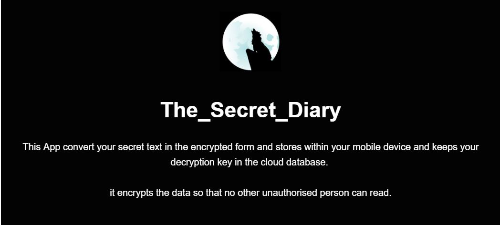
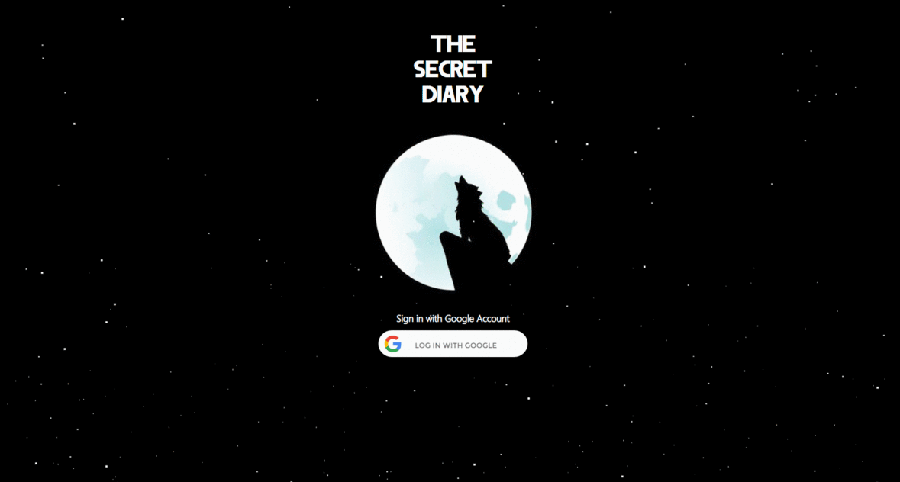

    
  </a>

**#Requirements**

Android device with minimum `Android version(4.3 Jelly Bean)`

**# Features**
* `Data Encyption using (AES):Advanced Encryption Standard`
* `Symmetric Key`
* `Google Authentication`
* `Firebase Database`
* `Additional Website`

**# App Screenshort** 

 

**#what if phone will lost ?**
 At that time `The_Secret_Diary` website will help you.
 
You have to simply visit the site and follow this Steps.

 
after that your key will Successfully removed from the database.
if any other person try to decrypt the your text it will simply show a message `Key is removed`.
  

**# Website Screenshort**

 
  

 
  

